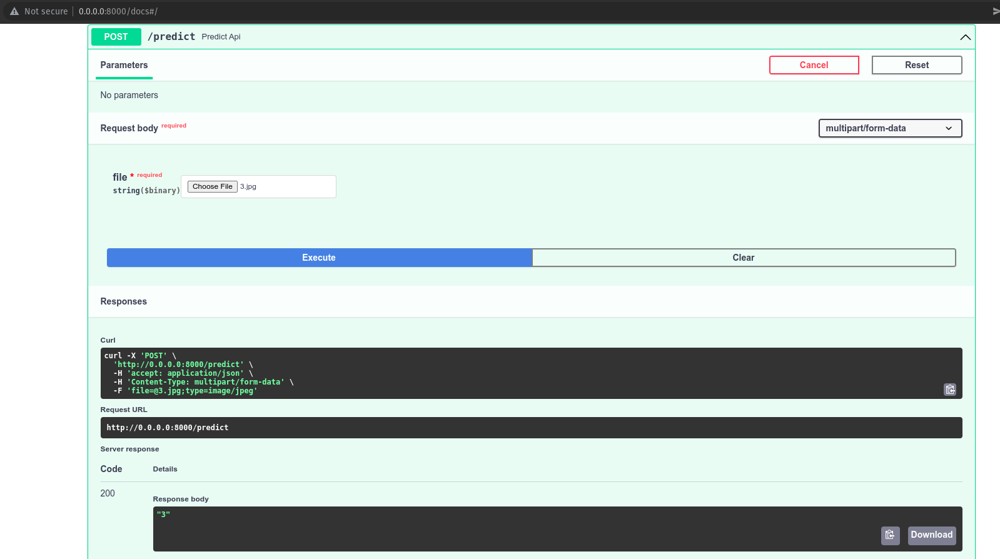
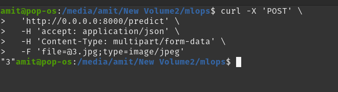

# MLOps
sample repo for MLOps

| file | description |
------------- | -------------
| `train_mnist.ipynb` | trained using fastai |
| `inference.py` | python inference |
| `app.py` | deploy using fastapi |
| `export.pkl` | fastai model |
|  `req_mnist.txt` | requirements (not all see Dockerfile)|
| `screenshots/curl_resp_mlops.png` | screenshot of output response using curl |
| `screenshots/fastapi_post.png` | screenshot of output response using fastapi (/docs) equivalent to postman |
| `Dockerfile` | use for building docker image |
| `docker-compose.yaml` | alternate for docker build |
| `3.jpg` | sample file for testing |

# build docker image
```bash
sudo docker build -t mnist:latest .
```

# launch the container
```bash
sudo docker run -p 8000:8000 --name mnist mnist:latest
```
OR

```bash
sudo docker-compose up
```

# Results
## using fastapi/postman equivalent

## using curl


# Criterias

| Criterias met | reasons |
------------- | -------------
|1. Low latency for inference | the code is structured in oop format so as to make the inference fast, also the model used in mobilenet v2 for transfer learning which is having less number of parameters which supports faster inference with better results/accuracy|
|2. Low inference docker image size | docker is built on top of python 3.8 image, also fastai is installed without any deps |
|3. Code structure | the code is in Object oriented format for better abstraction and code is seperated and isolated for particular tasks in a different files|