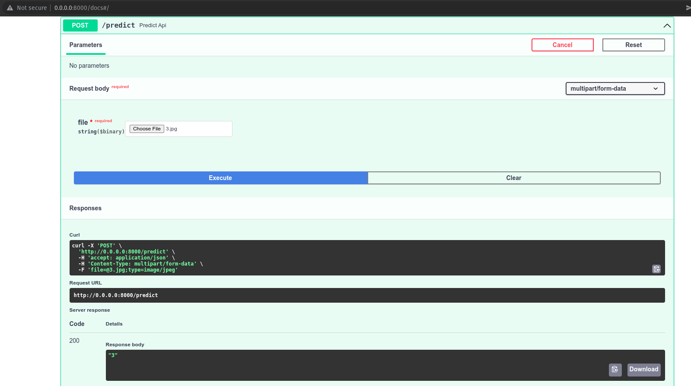
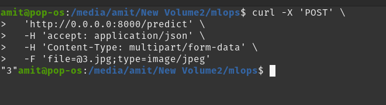

# MLOps
sample repo for MLOps

| file | description |
------------- | -------------
| `train_mnist.ipynb` | trained using fastai |
| `inferece.py` | python inferece |
| `app.py` | deploy using fastapi |
| `export.pkl` | fastai model |
|  `req_mnist.txt` | requirements (not all see Dockerfile)|
| `screenshots/curl_resp_mlops.png` | screenshot of output response using curl |
| `screenshots/fastapi_post.png` | screenshot of output response using fastapi (/docs) equivalent to postman |
| `Dockerfile` | use for building docker image |
| `docker-compose.yaml` | alternate for docker build |
| `3.jpg` | sample file for testing |

# build docker image
```bash
sudo docker build -t mnist:latest .
```

# launch the container
```bash
sudo docker run -p 8000:8000 --name mnist mnist:latest
```
OR

```bash
sudo docker-compose up
```

# Results
## using fastapi/postman equivalent

## using curl
